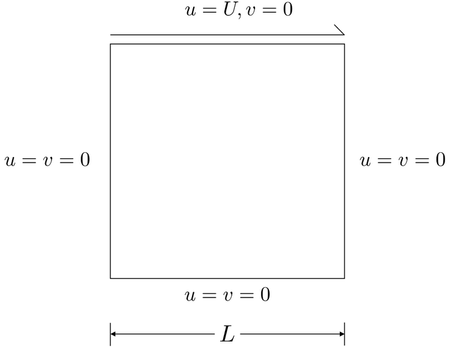

# CFD_verification

A Computational Fluid Dynamics (CFD) solver designed in fenics for coupling with festim in order to have an advection field projected onto a hydrogen transport simulation domain.

Two case studies are used for verifcation, the lid driven cavity for testing the cfd solver, and the heat driven cavity for testing buoyancy effects.

## Install Docker container
The FEniCS project provides a [Docker image](https://hub.docker.com/r/fenicsproject/stable/) with FEniCS and its dependencies (python3, UFL, DOLFIN, numpy, sympy...)  already installed. See their ["FEniCS in Docker" manual](https://fenics.readthedocs.io/projects/containers/en/latest/).

Get Docker [here](https://www.docker.com/community-edition).

Pull the Docker image and run the container, sharing a folder between the host and container:

For Windows users:
```python
docker run -ti -v ${PWD}:/home/fenics/shared --name cfd_verification quay.io/fenicsproject/stable:latest
```

## Lid driven cavity



The lid driven cavity is a simple cfd solver test case in which the top side of a cavity is given an imposed velocity condition, the location of the vorticies produced can be compared to a reference solution, in this case the reference paper is:


 - Zhixiang Liu, _et al._, _A multi-domain decomposition strategy for the lattice Boltzmann method for steady-state flows_. Engineering Applications of Computational Fluid Mechanics, 10(1), 2016, DOI: [10.1080/19942060.2015.1092743](https://doi.org/10.1080/19942060.2015.1092743 )


## Heat driven cavity


The heat driven cavity is a simple cfd solver test case in which the left and right side of a cavity is given imposed temperature conditions, velocity, temperature and pressure fields produced can be compared to a reference solution, in this case the reference paper is:

 - B.S.V. Patnaik, C. Wan, G.W. Wei. _A New Benchmark quality solution for the buoyancy-driven cavity by discrete singular convolution_. Numerical Heat Transfer: Part B: Fundamentals, 40(March):199–228, 2001, DOI: [10.1080/104077901752379620](https://doi.org/10.1080/104077901752379620)


## Install festim 

Install a FESTIM v0.10.0
```
pip install festim
```